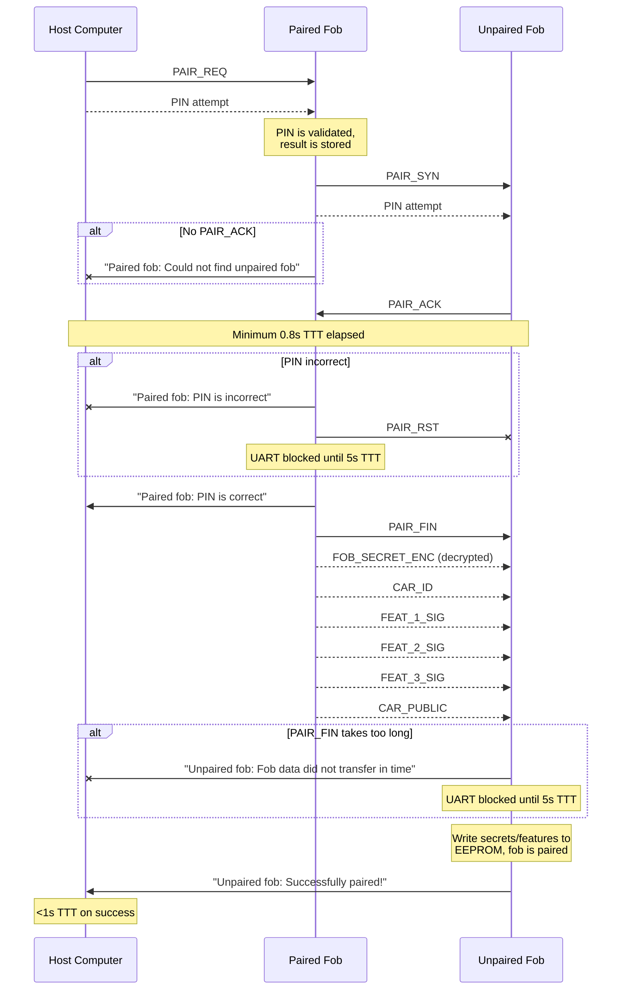
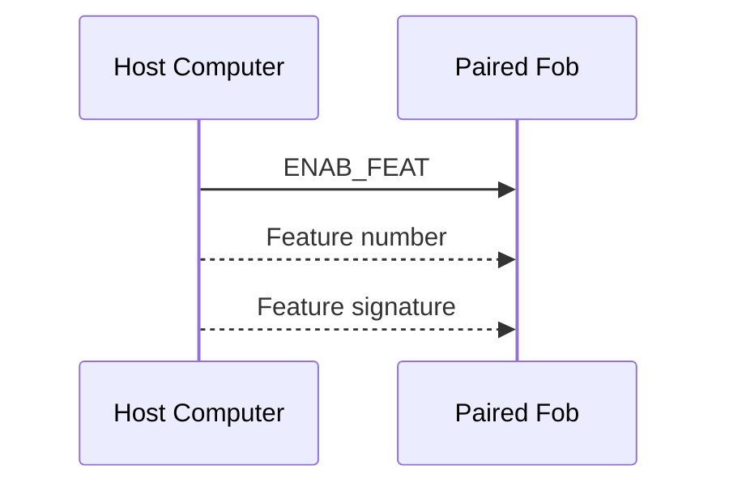
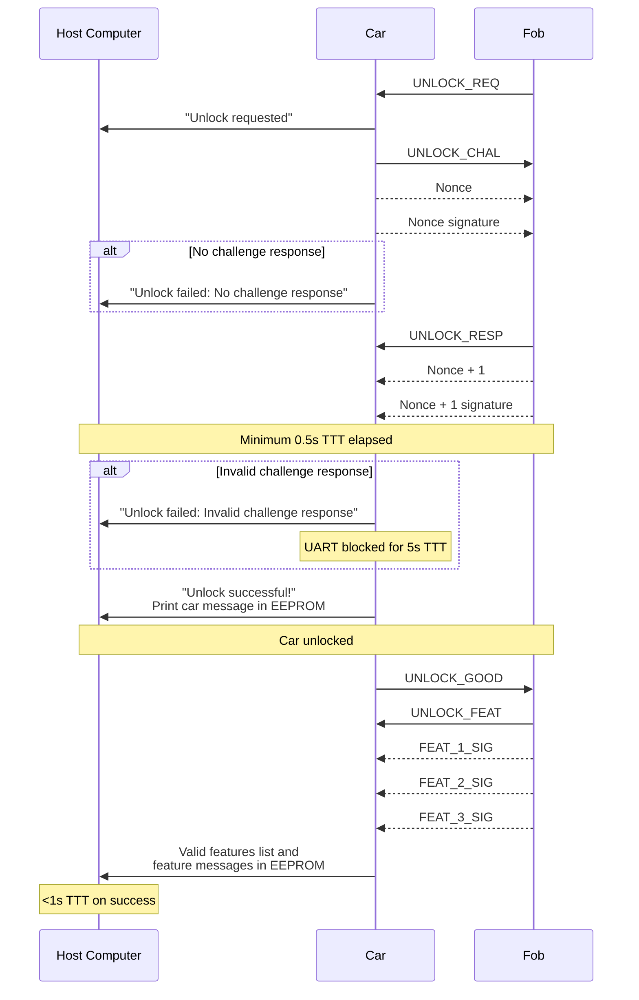

# PwnyPARED Protocol

The PwnyPARED protocol dictates UART communication for SIGPwny's 
implementation of a car and keyfob system for MITRE's eCTF 2023.

> **Note**  
> "TTT" refers to "total transaction time."

## Pairing Fobs

### PAIR_REQ
Sent by the host computer to initialize the paired fob for the pairing 
process. The paired fob checks the PIN (combined with the paired fob salt) 
against the hashed PIN stored in its EEPROM. Once done, it attempts to 
synchronize with the unpaired fob.

|             | Magic     | PIN               |
| ----------- | --------- | ----------------- |
| **Bytes**   | `\x40`    | `\x??\x??\x??`    |
| **Offsets** | 0x0 - 0x1 | 0x1 - 0x4         |

### PAIR_SYN
Sent by the paired fob to initialize the unpaired fob for the pairing process. 
The paired fob then waits for `PAIR_ACK`. If `PAIR_ACK` is not received after 
500ms TTT, an error is sent to the host computer.

When the unpaired fob receives `PAIR_SYN`, it will store the PIN in a 
variable, then send a `PAIR_ACK`.

|             | Magic     | PIN               |
| ----------- | --------- | ----------------- |
| **Bytes**   | `\x41`    | `\x??\x??\x??`    |
| **Offsets** | 0x0 - 0x1 | 0x1 - 0x4         |

### PAIR_ACK
Sent by the unpaired fob to the paired fob after it saves the PIN from 
`PAIR_SYN`. The paired fob will start decrypting the encrypted car secret with 
the provided PIN and stored salt, regardless if the PIN is correct or not. 
After this, if 800ms TTT has not yet elapsed, the paired fob will wait until 
then.

After this delay, if the PIN is incorrect, it will send an error to the host 
computer and a `PAIR_RST` to the unpaired fob. It will also block UART until 
5000ms TTT. If the PIN is correct, it will send a `PAIR_FIN` along with the 
fob data to the unpaired fob.

|             | Magic     |
| ----------- | --------- |
| **Bytes**   | `\x42`    |
| **Offsets** | 0x0 - 0x1 |

### PAIR_FIN
Sent by the paired fob to the unpaired fob to transfer fob data. The 
transmitted fob data includes the decrypted car secret and three features. All 
data stored at each feature signature is sent regardless of whether the 
feature is enabled or not. This ensures that the payload is of fixed length.

If more than 500ms passes while the unpaired fob awaits the entire payload to 
be sent (over 1000ms TTT), then the unpaired fob will send an error message to 
the host computer and block UART for an additional 3500ms (<5000ms TTT).

Otherwise, once the entire payload is received, the unpaired fob will write 
and recreate the EEPROM structure of the paired fob (using its own salt to 
encrypt the car secret). A success message is sent to the host computer once 
this is completed.

|             | Magic     | Fob secret (decrypted) | Car ID         | Feature signatures | Car public key |
| ----------- | --------- | ---------------------- | -------------- | ------------------ | -------------- |
| **Bytes**   | `\x43`    | 32 bytes               | 32 bit integer | 3 x 64 bytes       | 64 bytes       |
| **Offsets** | 0x0 - 0x1 | 0x01 - 0x21            | 0x21 - 0x25    | 0x25 - 0xE5        | 0x0E5 - 0x125  |

### PAIR_RST
If received, the fob will exit the current transaction (reset). The fob is not 
guaranteed to be listening for a reset.

|             | Magic     |
| ----------- | --------- |
| **Bytes**   | `\x44`    |
| **Offsets** | 0x0 - 0x1 |

## Enabling Features

### ENAB_FEAT
Sent from the host computer to a paired fob. Only paired fobs will act on 
this message. The fob will not make any attempt to validate the feature, 
except that the feature number is of the values 1, 2, or 3.

|             | Magic     | Feature number | Feature signature |
| ----------- | --------- | -------------- | ----------------- |
| **Bytes**   | `\x50`    | 32 bit integer | 64 bytes          |
| **Offsets** | 0x0 - 0x1 | 0x1 - 0x5      | 0x05 - 0x45       |

## Unlocking Car

### UNLOCK_REQ
Sent by the fob to the car when SW1 on the fob is pressed, requesting an unlock.

|             | Magic     |
| ----------- | --------- |
| **Bytes**   | `\x60`    |
| **Offsets** | 0x0 - 0x1 |

### UNLOCK_CHAL
Sends a challenge from the car to the fob in order to authenticate. The 
challenge contains a generated nonce value (64 bit integer), along with a 
signature of the nonce using  the car's secret key. In order to complete the 
challenge, the fob must add 1 to the nonce and send the result in an 
`UNLOCK_RESP` to the car.

|             | Magic     | Nonce             | Nonce signature |
| ----------- | --------- | ----------------- | --------------- |
| **Bytes**   | `\x61`    | 64 bit integer    | 64 bytes        |
| **Offsets** | 0x0 - 0x1 | 0x1 - 0x9         | 0x09 - 0x49     |

### UNLOCK_RESP
Send by the fob to the car. The nonce value from `UNLOCK_CHAL` is incremented 
and sent, along with a signature of the modified nonce using the fob's secret
key. The fob should only send a response after validating the signature 
included in `UNLOCK_CHAL`.

|             | Magic     | Nonce + 1         | Nonce + 1 signature |
| ----------- | --------- | ----------------- | ------------------- |
| **Bytes**   | `\x62`    | 64 bit integer    | 64 bytes            |
| **Offsets** | 0x0 - 0x1 | 0x1 - 0x9         | 0x09 - 0x49         |

### UNLOCK_GOOD
If the challenge was solved (and the signature from `UNLOCK_RESP` is valid), 
then the car should now be unlocked. This message is sent from the car asking 
the fob for its stored features.

|             | Magic     |
| ----------- | --------- |
| **Bytes**   | `\x63`    |
| **Offsets** | 0x0 - 0x1 |

### UNLOCK_FEAT
This is sent from the fob to the car and contains the feature numbers as well 
as their respective signatures. The car will validate the provided features 
using the signatures. Feature signatures are sent in order (1, 2, 3). The fob 
will send data stored at feature EEPROM regardless of whether there is an 
enabled feature.

|             | Magic     | Feature signatures |
| ----------- | --------- | ------------------ |
| **Bytes**   | `\x64`    | 3 x 64 bytes       |
| **Offsets** | 0x0 - 0x1 | 0x01 - 0xC1        |

> **Warning**  
> Car MUST include feature number and car ID combined/concatenated to validate 
> signature.

### UNLOCK_RST
If received, the fob or car will exit the current unlocking transaction 
(reset). The fob or car is not guaranteed to be listening for a reset.

|             | Magic     |
| ----------- | --------- |
| **Bytes**   | `\x69`    |
| **Offsets** | 0x0 - 0x1 |
