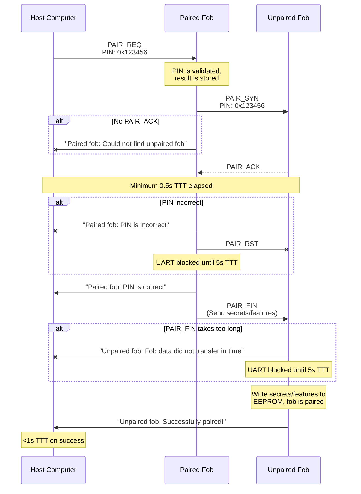
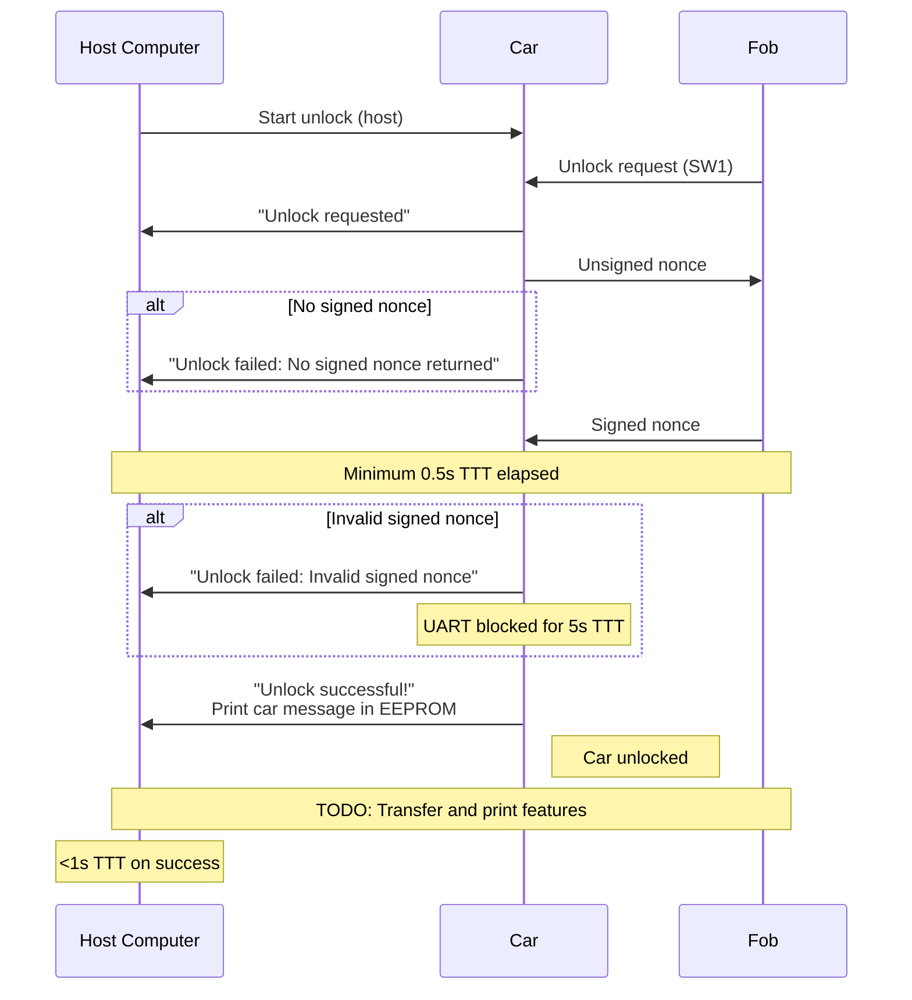

# PwnyPARED Protocol

> **Warning**  
> This protocol is still under active development and changes can be made at 
any point.

The PwnyPARED protocol dictates UART communication for SIGPwny's 
implementation of a car and keyfob system for eCTF 2023.

> **Note**  
> "TTT" refers to "total transaction time."

## Building (Host Tools)

*TODO*

## Pairing Fobs

### PAIR_REQ
Sent by the host computer to initialize the paired fob for the pairing 
process. The paired fob checks the PIN (combined with the paired fob salt) 
against the hashed PIN stored in its EEPROM. Once done, it attempts to 
synchronize with the unpaired fob.

|             | Magic     | PIN               |
| ----------- | --------- | ----------------- |
| **Bytes**   | `\x40`    | `\x??\x??\x??`    |
| **Offsets** | 0x0 - 0x1 | 0x1 - 0x4         | 
| **Notes**   |           | Packed big-endian |

### PAIR_SYN
Sent by the paired fob to initialize the unpaired fob for the pairing process. 
The paired fob then waits for `PAIR_ACK`. If `PAIR_ACK` is not received after 
500ms TTT, an error is sent to the host computer.

When the unpaired fob receives `PAIR_SYN`, it will store the PIN in a 
variable, then send a `PAIR_ACK`.

|             | Magic     | PIN               |
| ----------- | --------- | ----------------- |
| **Bytes**   | `\x41`    | `\x??\x??\x??`    |
| **Offsets** | 0x0 - 0x1 | 0x1 - 0x4         | 
| **Notes**   |           | Packed big-endian |

### PAIR_ACK
Sent by the unpaired fob to the paired fob after it saves the PIN from 
`PAIR_SYN`. The paired fob will start decrypting the encrypted car secret with 
the provided PIN and stored salt, regardless if the PIN is correct or not. 
After this, if 500ms TTT has not yet elapsed, the paired fob will wait until 
then.

After this delay, if the PIN is incorrect, it will send an error to the host 
computer and a `PAIR_RST` to the unpaired fob. It will also block UART until 
5000ms TTT. If the PIN is correct, it will send a `PAIR_FIN` along with the 
fob data to the unpaired fob.

|             | Magic     |
| ----------- | --------- |
| **Bytes**   | `\x42`    |
| **Offsets** | 0x0 - 0x1 |
| **Notes**   |           |

### PAIR_FIN
Sent by the paired fob to the unpaired fob to transfer fob data. The 
transmitted fob data includes the decrypted car secret and three features. If 
there are less than three features, null bytes will be sent in place of 
missing features. This ensures that the payload is of fixed length.

If more than 500ms passes while the unpaired fob awaits the entire payload to 
be sent (over 1000ms TTT), then the unpaired fob will send an error message to 
the host computer and block UART for an additional 3500ms (<5000ms TTT).

Otherwise, once the entire payload is received, the unpaired fob will write 
and recreate the EEPROM structure of the paired fob (using its own salt to 
encrypt the car secret). A success message is sent to the host computer once 
this is completed.

*TODO: Update with correct secret and feature lengths*

|             | Magic     | Car Secret            | Feature 1   | Feature 2   | Feature 3   |
| ----------- | --------- | --------------------- | ----------- | ----------- | ----------- |
| **Bytes**   | `\x43`    |  \<xxx bytes\>        | \<yy> bytes | \<yy> bytes | \<yy> bytes |
| **Offsets** | 0x0 - 0x1 | 0x1 - 0x??            | 0x?? - 0x?? | 0x?? - 0x?? | 0x?? - 0x?? |
| **Notes**   |           | In order (big-endian) | Sent as-is  | Sent as-is  | Sent as-is  |

### PAIR_RST
If received, the fob will exit the current transaction (reset). The fob is not 
guaranteed to be listening for a reset.

|             | Magic     |
| ----------- | --------- |
| **Bytes**   | `\x44`    |
| **Offsets** | 0x0 - 0x1 |
| **Notes**   |           |

## Packaging Features

*TODO*

## Enabling Features

*TODO*

## Unlocking Car

*TODO*