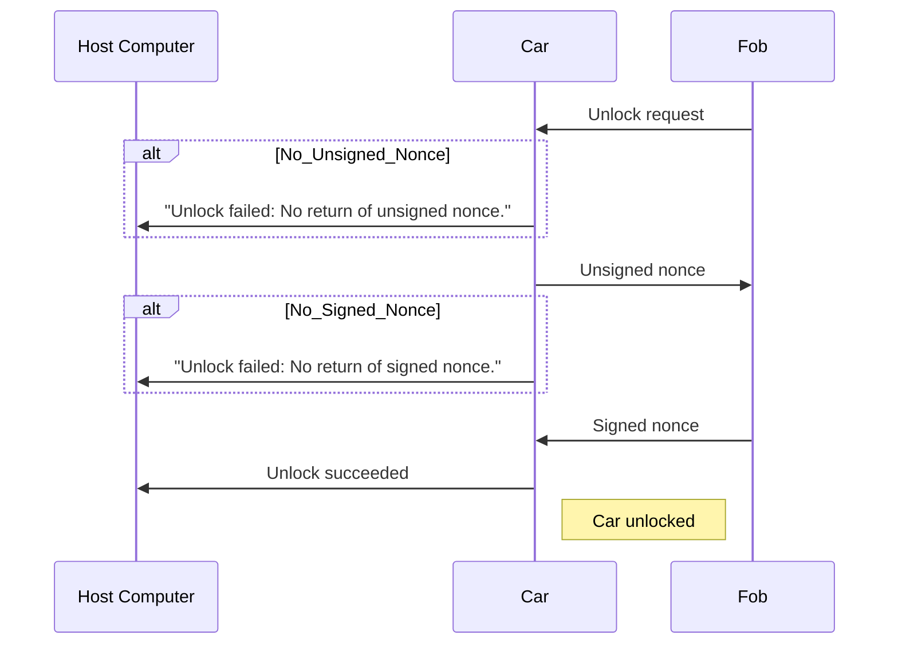

# PwnyPARED Protocol

> **Warning**  
> This protocol is still under active development and changes can be made at any point.

The PwnyPARED protocol dictates UART communication for SIGPwny's implementation of a car and keyfob system for eCTF 2023.

## Building (Host Tools)

## Pairing Fobs

**PAIR_REQ**

**PAIR_SYN**

**PAIR_SYN_ACK**

**PAIR_WRITE**

## Packaging Features

## Enabling Features

## Unlocking Car

